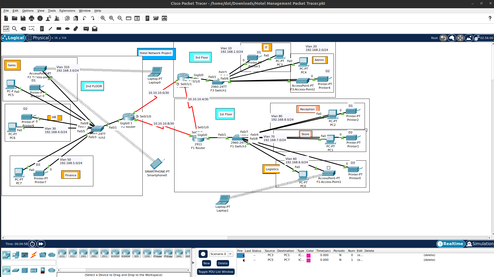

## Project Overview

This project simulates the network infrastructure of a hotel across **three floors** with separate VLANs for various departments. It includes both wired and wireless devices and uses routing between VLANs to ensure secure communication.

---

## Network Design Highlights

- 🔹 **Routers & Switches**: Layer 2 and Layer 3 design  
- 🔹 **VLANs** for:
  - Admin (VLAN 20)  
  - IT (VLAN 10)  
  - HR (VLAN 30)  
  - Sales (VLAN 310)  
  - Finance (VLAN 50)  
  - Logistics (VLAN 60)  
  - Store (VLAN 70)  
  - Reception (VLAN 80)
- 🔹 **IP Subnetting**: Each VLAN has a unique subnet  
- 🔹 **Wireless Access Points** for smartphones and laptops  
- 🔹 **End Devices**: PCs, printers, and wireless clients  
- 🔹 **Serial connections** to simulate WAN links between routers

## Topology Overview

- **3 Floors**: Each with its own switch, VLANs, and access points  
- **Core Routing**: Managed through routers using serial interfaces (`10.10.10.x/30` subnet)  
- **Access Points** for wireless connectivity  
- **DHCP/IP Configuration**: Manual for accuracy and control

## Learning Outcomes

- VLAN configuration & segmentation  
- Inter-VLAN routing setup  
- Router and switch configuration  
- IP subnetting and planning  
- Wireless device integration  
- Simulation and testing of connectivity

## Tools Used

- Cisco Packet Tracer (latest version)

## Screenshots

## Collaborations

Feel free to reach out for suggestions, collaborations, or improvements!

